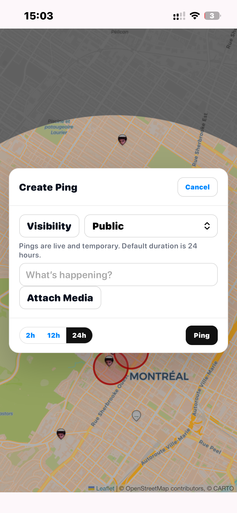
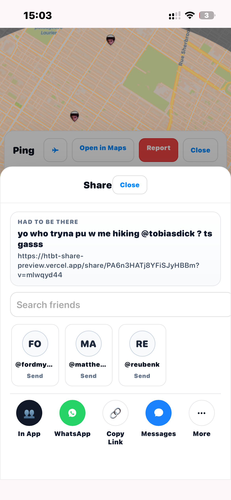
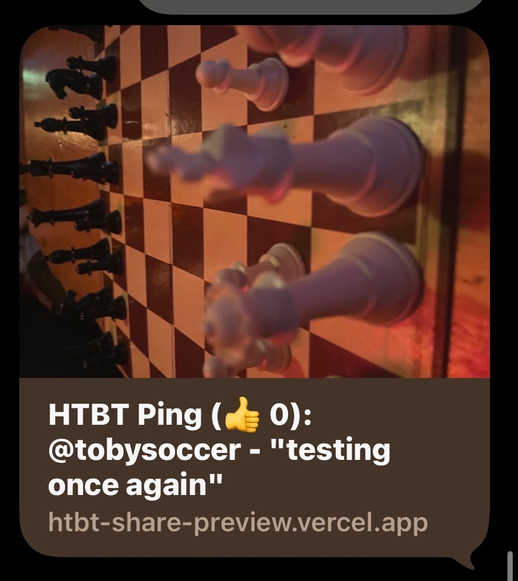

# Had To Be There (HTBT) - Product + Engineering Portfolio

This is a public portfolio companion for **Had To Be There**, a hyper-local social app with iOS wrapper + web app + Firebase backend.

## What this public repo is
- Product case-study
- Architecture overview
- Selected implementation details
- Screenshots and launch notes

## What this public repo is NOT
- Full private production source code
- Secrets, keys, or deploy credentials

## Product Summary
Had To Be There is an ephemeral location-based social app for sharing short local "pings". Core loop:
- See pings on map
- React/comment/share
- Post within local boundary
- Pings expire automatically

## Stack
- Frontend: Vanilla JS + CSS + Leaflet
- Mobile wrapper: Capacitor + iOS (Xcode)
- Backend: Firebase Auth, Firestore, Storage, Cloud Functions
- Payments/auth extensions integrated as needed

## My Role
Solo builder (product + frontend + backend integration + iOS wrapper + QA iteration + release prep).

## Links
- App/Web: https://had-to-be-there-18cd7.web.app

## Screenshot Gallery
### iOS App
**Main map (signed-in)**

**Crosshair location placement flow**

**Create ping modal**

**Share modal**

### Sharing and Preview
**iMessage preview card**

**Shared ping opened on web**

### Web App
**Desktop web map/feed**

**Firebase backend/data view**

**Mobile web map/feed**

## Internship Positioning
- End-to-end solo build across product, frontend, backend integration, and iOS wrapper.
- Real user feedback loop with rapid iteration on UX, reliability, and shipping.
- Production-minded thinking: auth states, sharing flows, edge-case handling, and release prep.

See:
- `ARCHITECTURE.md`
- `IMPACT.md`
- `CODE-SAMPLES.md`
